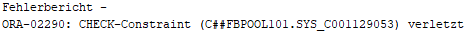

Lars Koenigsmann - 7209439 <br>
Mika Bredehoeft  - 7209429 <br>
Tobias Barthold  - 7209370
## Aufgabe 2 b)

### Statische Integritätsbedingungen

#### Passwort Check
````sql
passwort VARCHAR(64) NOT NULL CHECK(length(passwort) > 5)
````

Überprüft ob das Passwort länger als 5 Zeichen ist, da ein kürzeres
Passwort sonst zu unsicher ist. Darf zusätzlich nicht NULL sein da der Benutzer
ein Passwort eingeben muss um sich einloggen zu können mit seinem Benutzernamen. 
Bsp:
```sql
INSERT INTO ACCOUNT(ID,USERNAME,PASSWORT,MAIL,STREAMKEY,MODERATORID) VALUES(1,'username','kurz',...)
```
Klappt nicht, da das Passwort zu kurz ist.
<br>

#### VOD Status Check
````sql
status VARCHAR(7) DEFAULT 'public' NOT NULL CHECK (status in ('public', 'private'))
````
Der Status einens VOD muss public oder private sein, damit das Backend weiß 
ob es das VOD global erreichbar macht oder nur per direktlink. 

```sql
INSERT INTO vod(id, stream_id, clicks, status, location) values(4, 4, 69, 'priv', 'D:\TKKG_Streaming\VODs\6\6_ragingbull_stream.mp4');
```
Klappt nicht, da der Status nicht 'private' bzw. 'public' gesetzt ist. Der Insert schlägt fehl!
<br>

#### Subscriber
````sql
tier CHARACTER(1) DEFAULT 1 NOT NULL CHECK (tier BETWEEN '1' AND '3')
````
Der Tier eines Subscriber muss zwischen 1 und 3 sein, da ein status drüber oder drunter
für das Backend nicht auszuwerten wäre. Das Tier beschreibt wie viel der Subscriber für sein 
'Sub' bezahlt. (Siehe Tier Subscribtion bei Twich)

`````sql
INSERT INTO subscriber(partner_account_id, subscriber_account_id, tier, subscriber_start,subscriber_end, month_count) values(1,9,8,'10.09.2021','10.12.2021', 3);
`````
Klappt nicht, da Tier 8 undefiniert ist. Dies wäre für das Backend nicht mehr auszuwerten, deswegen
checkt oracle dass die Bedingung immer erfüllt sein muss.<br>


### Rekursive Beziehungen

#### Accounts
Accounts können die rekursive Beziehung moderatorid haben. Wenn dieser
Wert gesetzt ist, kann der Account der mit diesem Wert verbunden ist den anderen Account verwalten. 
<br>

Alle Drei Accounts haben den Moderator mit der AccountID 1 zugeordnet.
Das Bedeuet der Account mit der ID 1 kann Account 3,4 und 5 verwalten.<br>
So ergibt die folgende SQL Query, das Ergebnis wer welchen Account verwaltet: 
````sql
SELECT
    a.username as Verwalter,
    b.username as WirdVerwaltet
FROM
    accounts a,
    accounts b
WHERE
    a.id = b.moderatorid;
````
Folgenden Output:
<br>
<br>
Des Weiteren kann man mit der SQL Query: 
````sql
SELECT 
    a.username as Verwaltet, 
    COUNT(*) as VerwaltetCount
FROM 
    accounts a,
    accounts b
WHERE 
    a.id = b.moderatorID
GROUP BY
    a.username;
````
Herausfinden wie viele Accounts von einem User verwaltet werden.
<br>
Bsp Output: <br>
